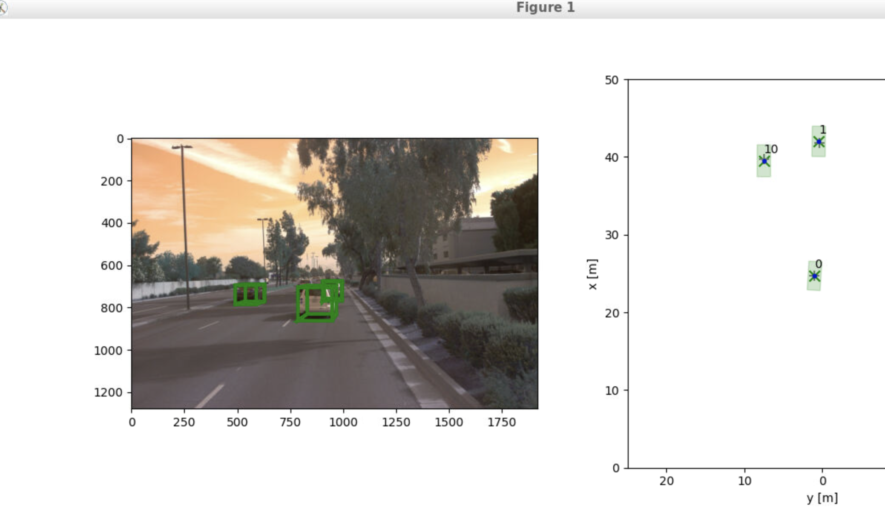
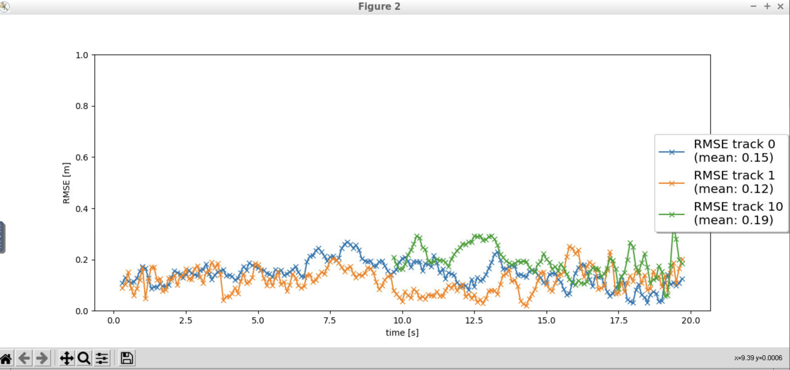
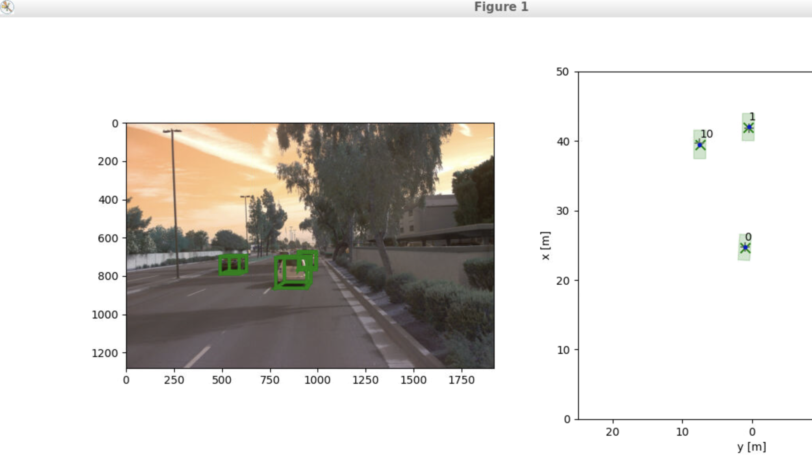
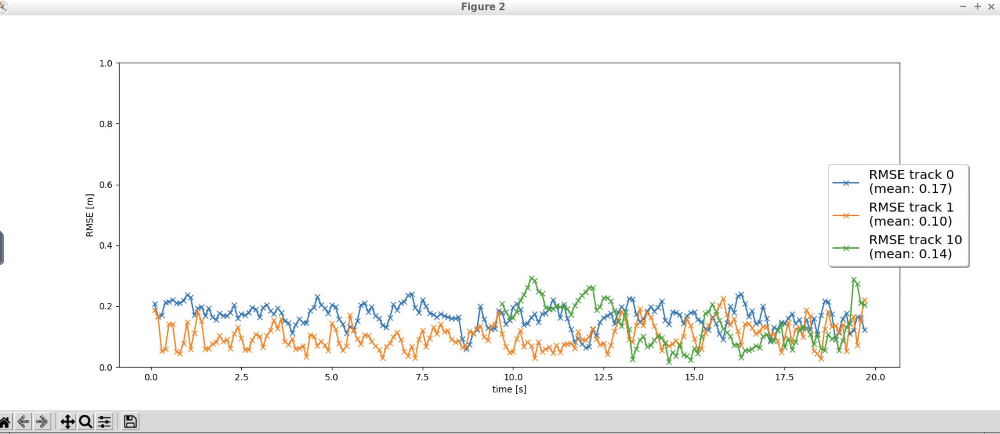

# Writeup: Track 3D-Objects Over Time

Please use this starter template to answer the following questions:

# 1. Write a short recap of the four tracking steps and what you implemented there (filter, track management, association, camera fusion). Which results did you achieve? Which part of the project was most difficult for you to complete, and why?

 
 
 
 

## step1 : Extended Kalman Filter

 

Implemented an EKF to track a single target with lidar measurement input.
implemented the predict() and update() function.
Implemented the F() function to calculate a system matrix for constant velocity process model. Implemented the Q() function to calculate the corresponding process noise covariance
 
 

### step1_Results:

 

We can visualize a single track.
The RMSE is around 0.32

 
 

## step2 : Track management

 
Implemented the track management to initialize and delete tracks. Also set a track state and a track score.
The track is first set to 'initialized' state and set an initial track score. As more measurements come in, the track score is updated and state is moved to 'tentative' or 'confirmed'. 
Also, the track score is decreased for unassigned tracks. Track is Deleted if the score is too low or P is too big. Track is deleted once its not in the visible range.
 
 

### step2_Results:
 

As per the visualization a new track is initialized when unassigned measurements occur and then the track is confirmed . The track is deleted after it has vanished from the visible range. 
The RMSE shows a single line and is around 0.78.
 

 
 

## step3 : Track Measurement association

 

Implemented a single nearest neighbor data association to associate measurements to tracks. Implemented multi target tracking.
Did actual association matrix based on Mahalanobis distance.
To check if a measurement lies inside a track's gate, used the gating() function.
For the single nearest neighbor algorithm, Found the minimum entry in association_matrix and used this association pair between track and measurement for the final assignment.

 
 

### step3_Results:
 

As per the visualization multiple tracks are updated with multiple measurements. There are some ghost tracks, which get deleted after sometime.
Finally there are 3 tracks.Tracks 0 and 1 are seen from the starting. Track 10 starts somewhere in the middle.
RMSE for track 0 is 0.15.RMSE for track 1 is 0.12. RMSE for track 10 is 0.19.
 

 
 

## step4 : Camera Fusion

 

Implemented the camera measurement model.  By combining camera and lidar, completed the sensor fusion module for camera-lidar fusion.
Implemented the function in_fov() to check  checks if the input state vector x lies in the sensor's field of view.

 Initialized camera measurement objects  and integrated the nonlinear camera measurement functions.
 
 ### step4_Results:
 

From the terminal console, We can see that the tracking update first updates all tracks with lidar measurements, then with camera measurements. As per the  visualization, multiple tracks are updated. There are some ghost tracks, which get deleted after sometime.
Finally there are 3 tracks.Tracks 0 and 1 are seen from the starting. Track 10 starts somewhere in the middle.
RMSE for track 0 is 0.17.RMSE for track 1 is 0.10. RMSE for track 10 is 0.14.
The performance is better now compared to lidar-only tracking.
 

 
 

Track management and  Track Measurement association were most difficult for me. There were challenges in setting up the state and in deleting the tracks. But i debugged the code for sample frames and printed the results on the console. I was able to fix the issues after that. For the association matrix, initially few of the same measurements were used multiple times. I was able to debug by printing it on the console and fixing the removal of measurement from the list.
But overall, the sample exercises in the lessons were very good and it helped to follow the final project and solve it.
 
 
 
 
# 2. Do you see any benefits in camera-lidar fusion compared to lidar-only tracking (in theory and in your concrete results)? 
 
 
As per the theoretical concepts, camera is good for classification of objects and for perceiving 2d structures and images like stop sign. Lidar is good for range measurement, performs much better in dark lighting conditions. Lidar is also supposed to be better in fog,rain. As we can see each sensor has its pros.
So, theoretically having multiple sensors like camera and lidar will increase the overall accuracy and safety of the self driving systems.
 
As per the results from the project, rmse did decrease for majority of the tracks when using camera-lidar fusion instead of the lidar-only tracking. 
Also while observing the tracking visualization, the ghost tracks seemed to disappear faster and out of range tracks were deleted faster using the camera-lidar fusion.

Both theoretically and practically(based on project results) there are benefits in camera-lidar fusion compared to lidar-only tracking
 
 
# 3. Which challenges will a sensor fusion system face in real-life scenarios? Did you see any of these challenges in the project?
 
 
In real-life scenario, there will be many challenges for sensor fusion system. There will be different types of vehicles. There would be pedestrians, cyclists etc. The weather conditions would be different, the lighting conditions would be different. 
A steep road with curves could also pose problems and narrow winding roads would be challenging.

There were some challenges for the system in the project. There were some trees and bushes which caused ghost tracks to appear.
 
 

# 4. Can you think of ways to improve your tracking results in the future?

One easy way would be fuse together even more sensors from like more lidars and more cameras. Also individual sections can probably made better with more complex algorithms. Track management and Track measurement association can probably be improved with more sophisticated algorithms.